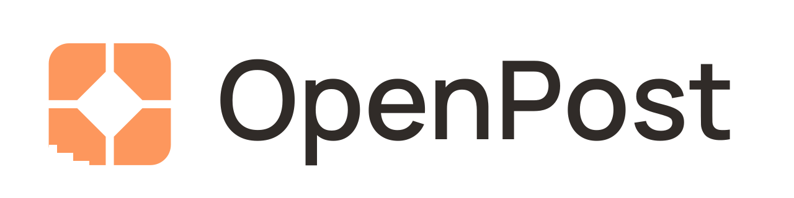
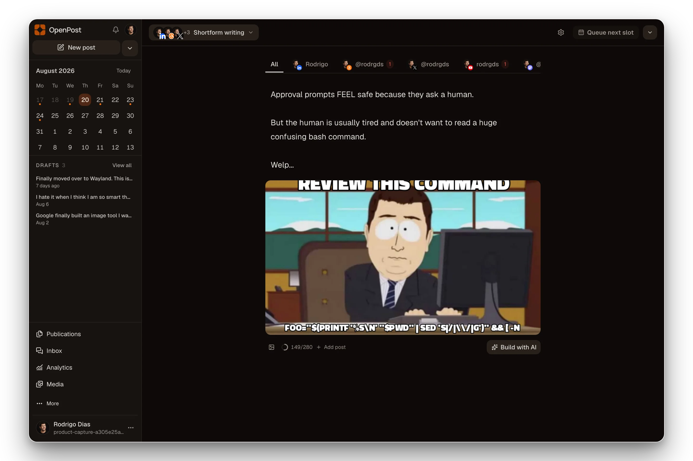
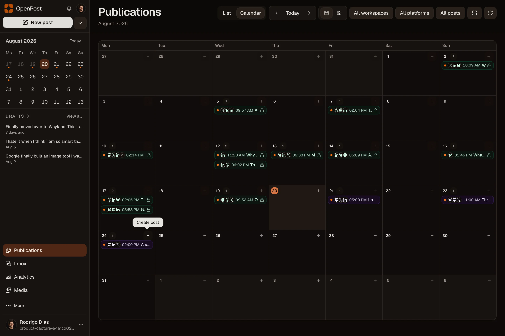
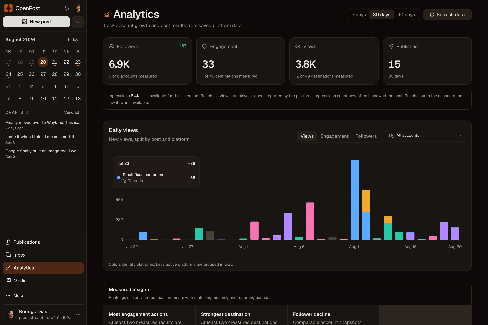
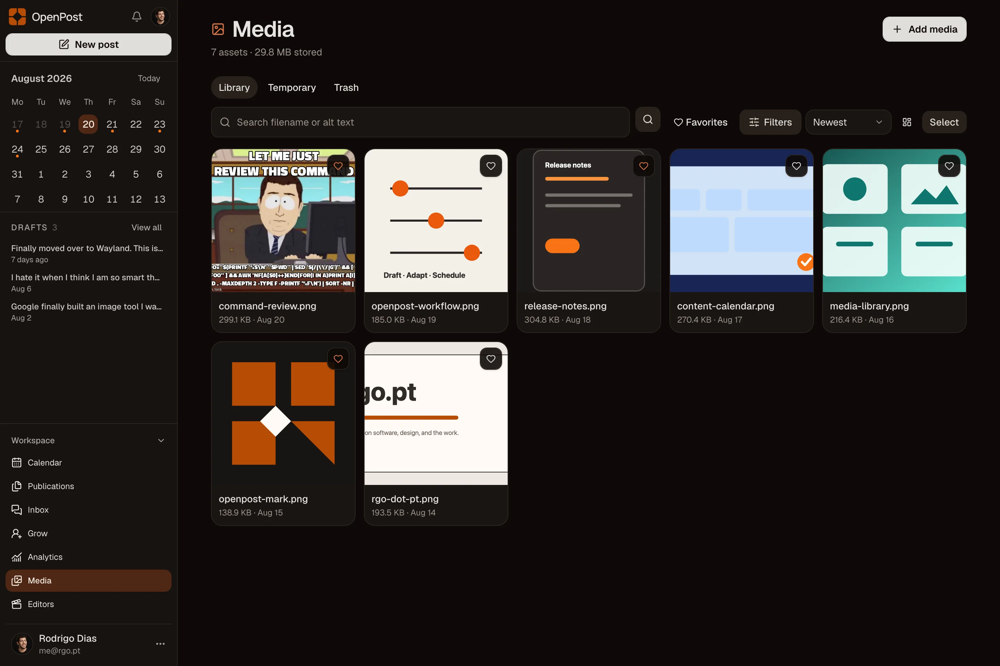
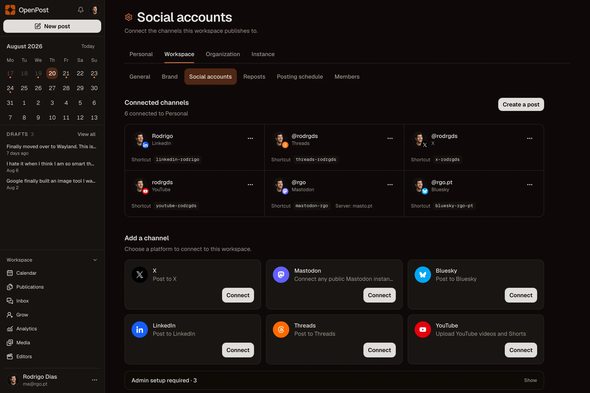
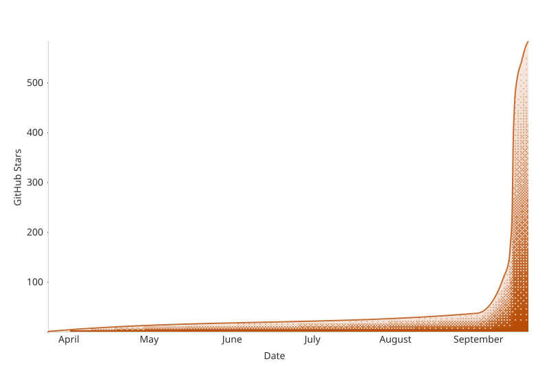

<p align="center">
  <a href="https://openpost.social">
    <picture>
      <source media="(prefers-color-scheme: dark)" srcset="./assets/brand/lockup-dark.svg">
      <source media="(prefers-color-scheme: light)" srcset="./assets/brand/lockup.svg">
      
    </picture>
  </a>
</p>

<p align="center">
  <strong>Write once. Shape every channel. Know what shipped.</strong>
  <br>
  One social publishing workspace for founders, creators, teams, and agencies.
</p>

<p align="center">
  <a href="https://github.com/getopenpost/openpost/releases">
    
  </a>
  <a href="https://github.com/getopenpost/openpost/actions/workflows/ci.yml">
    
  </a>
  <a href="https://github.com/getopenpost/openpost">
    
  </a>
  <a href="https://github.com/getopenpost/openpost/releases">
    
  </a>
</p>

<p align="center">
  <a href="https://app.openpost.social/register?plan=founder&amp;billing_period=monthly"><strong>Start a 14-day trial</strong></a>
  ·
  <a href="https://docs.openpost.social/guide/quickstart"><strong>Self-host</strong></a>
  ·
  <a href="https://docs.openpost.social"><strong>Docs</strong></a>
  ·
  <a href="https://discord.gg/u2QwukmY4W"><strong>Discord</strong></a>
</p>

<p align="center">
  
</p>

You already have the material. A launch. An update. Something you learned the hard way. OpenPost takes that and makes it fit each channel. It shows you what each destination allows before you publish, lets you schedule it, and then shows you what actually happened. No hidden rules.

<table>
  <tr>
    <td width="50%" align="center">
      
      <br><strong>Plan the month</strong><br><sub>Drafts, scheduled posts, and published work stay in one calendar.</sub>
    </td>
    <td width="50%" align="center">
      
      <br><strong>See what worked</strong><br><sub>Track real provider metrics without mixing views, impressions, and reach.</sub>
    </td>
  </tr>
  <tr>
    <td width="50%" align="center">
      
      <br><strong>Reuse your brand</strong><br><sub>Keep images, videos, designs, and their usage in the shared library.</sub>
    </td>
    <td width="50%" align="center">
      
      <br><strong>Keep provider truth visible</strong><br><sub>Connect each channel once, then see its real setup and publishing state.</sub>
    </td>
  </tr>
</table>

## What you get

- **A composer that respects each channel.** Write once, then fix the text, media, and timing for each account. It will not let you push a 280-character thread to LinkedIn and pretend it worked.
- **A queue that remembers.** Everything scheduled lives in the database. Restart the server and it is still there. You see if it is queued, published, failed, or waiting to retry.
- **One place for your work.** Publications, media, calendar, analytics, and comments live in the same workspace. Not five tabs pretending to be one product.
- **Tools where you need them.** Edit an image. Cut a short video. Make a meme. Write alt text. It saves back to your library. No need to open another app.
- **Same app everywhere.** Web, Android, API, CLI, MCP. Same words, same permissions, same state. I built it that way because different behavior on different surfaces breaks trust.

You will not find a CRM, ad manager, or social listening here. There are better tools for that. I run the hosted version for you. Self-hosting is there if you want to own the box, the backups, and the provider setup yourself.

## Get started

Use the [Hosted service](https://app.openpost.social) if you want OpenPost managed for you.

To run it yourself:

```bash
git clone https://github.com/getopenpost/openpost.git
cd openpost
cp .env.example .env
# Set OPENPOST_APP_URL and replace the two example secrets in .env.
docker compose up -d
```

Open `http://localhost:8080`, create the first account, and connect a social account. The default setup uses one container, SQLite, local media, and database-backed jobs. The current amd64 image is published at [`ghcr.io/getopenpost/openpost`](https://github.com/getopenpost/openpost/pkgs/container/openpost).

[Read the self-hosting quickstart](https://docs.openpost.social/guide/quickstart) · [Installation reference](https://docs.openpost.social/self-hosting/) · [Hosted and self-hosted boundary](https://openpost.social/self-hosted)

## Providers

OpenPost talks to X, Mastodon, Bluesky, LinkedIn profiles and company pages, Threads, Facebook Pages, Instagram, TikTok, YouTube, and Discord webhooks.

An adapter means I built it, not that it is ready on the hosted service. Some need app review. Some need the right account type or scopes. Those checks stay separate so you see the real state before you publish.

<!-- provider-certification:begin -->

The checked-in public certification manifest contains **0 exact provider-format claims**.

No Hosted service provider-format certification claim is current. Implementation descriptions do not assert Hosted service availability.
<!-- provider-certification:end -->

[Provider readiness](https://docs.openpost.social/operations/provider-launch-matrix) · [Platform limits](https://docs.openpost.social/providers/)

## Automate it

Give a token to the API, CLI, or MCP server and it works like you do. Same workspace. Same permissions. You can automate a post without handing over your social logins. I use one permission model everywhere. Separate models are where things quietly break.

[CLI guide](https://docs.openpost.social/cli/) · [MCP guide](https://docs.openpost.social/mcp/) · [API reference](https://docs.openpost.social/development/api-reference)

## Develop OpenPost

OpenPost uses Go, Svelte 5, SvelteKit, Bun, and Devenv.

```bash
direnv allow
devenv shell -- setup
bun run verify
```

Read [CONTRIBUTING.md](CONTRIBUTING.md) and the [development docs](https://docs.openpost.social/development/setup) before opening a pull request.

## Help OpenPost grow

If OpenPost is useful to you, **star the repository**. It helps other self-hosters find the project and tells us which work is worth continuing.

<!-- star-history:start -->
<picture>
  <source media="(prefers-color-scheme: dark)" srcset="assets/star-history/star-history-dark.svg">
  
</picture>
<!-- star-history:end -->

## License and security

OpenPost is licensed under [AGPL-3.0-only](LICENSE). Report vulnerabilities privately through the [security policy](SECURITY.md).
