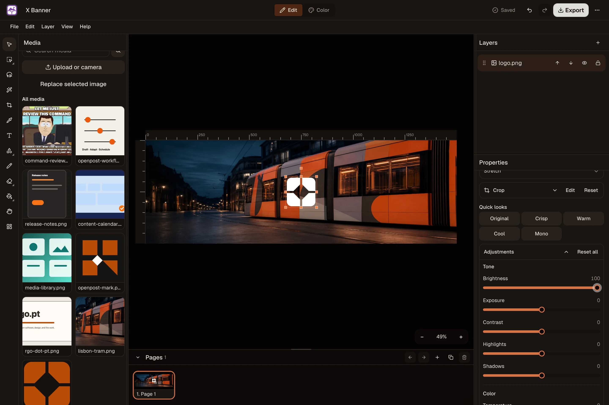
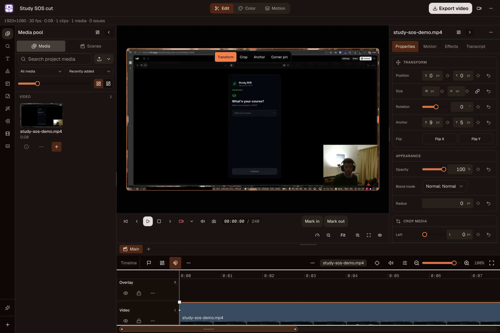

<p align="center">
  <a href="https://openpost.social">
    <picture>
      <source media="(prefers-color-scheme: dark)" srcset="./assets/brand/lockup-dark.svg">
      <source media="(prefers-color-scheme: light)" srcset="./assets/brand/lockup.svg">
      
    </picture>
  </a>
</p>

<p align="center">
  <strong>Your socials, on steroids.</strong>
  <br>
  Turn one post into the right version for each account, then schedule it and see what worked.
</p>

<p align="center">
  <a href="https://github.com/getopenpost/openpost/releases">
    
  </a>
  <a href="https://github.com/getopenpost/openpost">
    
  </a>
  <a href="https://github.com/getopenpost/openpost/releases">
    
  </a>
</p>

<p align="center">
  <a href="https://app.openpost.social/register?plan=founder&amp;billing_period=monthly"><strong>Start a 14-day trial</strong></a>
  ·
  <a href="https://docs.openpost.social/guide/quickstart"><strong>Run your own</strong></a>
  ·
  <a href="https://docs.openpost.social"><strong>Docs</strong></a>
  ·
  <a href="https://discord.gg/u2QwukmY4W"><strong>Discord</strong></a>
</p>

<p align="center">
  
</p>

Start with something you already have: a launch, a product update, or the bug you finally fixed. OpenPost lets you adapt it for each account, schedule every version, and see the result each provider reports. Views, impressions, and reach stay separate because each platform defines them differently.

<table>
  <tr>
    <td width="50%" align="center">
      
      <br><strong>Plan the month</strong><br><sub>Keep scheduled and published work in one calendar.</sub>
    </td>
    <td width="50%" align="center">
      
      <br><strong>See what worked</strong><br><sub>Compare daily views, engagement, and follower changes without combining unlike metrics.</sub>
    </td>
  </tr>
</table>

<table>
  <tr>
    <td width="50%" align="center">
      
      <br><strong>Edit the image</strong><br><sub>Layer text, shapes, and workspace media, then save the result back to Media.</sub>
    </td>
    <td width="50%" align="center">
      
      <br><strong>Cut the video</strong><br><sub>Export an MP4 or send it straight to OpenPost Media.</sub>
    </td>
  </tr>
</table>

## What you get

- Write one post, then adjust its text, media, format, timing, and provider settings for each account.
- Scheduled work lives in the database. Restart the server and it is still there. You can see what is scheduled, published, failed, or waiting to retry.
- Posts, saved media, the calendar, analytics, and replies stay in the same workspace.
- Edit images, cut video, make memes, and add alt text without moving files between apps.
- The web app, HTTP API, CLI, and MCP server read and change the same saved posts under the same permissions. Android focuses on quick capture, queue checks, and small edits.

OpenPost is for publishing. It is not a CRM, ad manager, or broad social listening tool. Hosted runs the service for you. Self-hosting means you own the server, backups, updates, provider apps, and secrets.

## Get started

Choose [OpenPost Hosted](https://app.openpost.social) if you want us to run it.

To run it yourself:

```bash
git clone https://github.com/getopenpost/openpost.git
cd openpost
cp .env.example .env
# Set fresh secrets and OPENPOST_APP_URL, OPENPOST_PUBLIC_URL, and OPENPOST_MEDIA_URL.
docker compose up -d
```

Open `http://localhost:8080`, create the first account, and connect a social account. The default setup runs one container with SQLite, local media, and database-backed jobs. The published container supports `linux/amd64`. Other host architectures need amd64 emulation. A native image requires a custom build and full runtime validation.

[Self-hosting quickstart](https://docs.openpost.social/guide/quickstart) · [Installation reference](https://docs.openpost.social/self-hosting/) · [Hosted or self-hosted?](https://openpost.social/self-hosting)

## Providers

OpenPost has adapters for X, Mastodon, Bluesky, LinkedIn profiles and Organization Pages, Threads, Facebook Pages, Instagram Business or Creator accounts, TikTok, YouTube, and Discord webhooks.

An adapter in the code does not mean OpenPost Hosted can use it today. Some providers still require app review, a certain account type, extra scopes, or public media URLs. OpenPost shows what is missing before you publish.

<!-- provider-certification:begin -->

No posting option has passed our final live check on OpenPost Hosted yet.

A social app can appear in OpenPost before it is ready for real accounts.
<!-- provider-certification:end -->

[Provider readiness](https://docs.openpost.social/operations/provider-launch-matrix) · [Platform rules](https://docs.openpost.social/providers/)

## Automate it

The API, CLI, and MCP server use the same workspace permissions as the app. They can create, validate, schedule, and inspect publications without exposing social account credentials. Give each client its own token, choose the narrowest scope that works, and bind it to one workspace when possible.

[CLI guide](https://docs.openpost.social/cli/) · [MCP guide](https://docs.openpost.social/mcp/) · [API reference](https://docs.openpost.social/development/api-reference)

## Develop OpenPost

OpenPost uses Go, Svelte 5, SvelteKit, Bun, and Devenv.

```bash
direnv allow
devenv shell -- setup
bun run verify
```

Read [CONTRIBUTING.md](CONTRIBUTING.md) and the [development setup](https://docs.openpost.social/development/setup) before opening a pull request.

## Help OpenPost grow

If OpenPost is useful to you, **star the repository**. It helps other self-hosters find the project.

<!-- star-history:start -->
<picture>
  <source media="(prefers-color-scheme: dark)" srcset="assets/star-history/star-history-dark.svg">
  
</picture>
<!-- star-history:end -->

## License and security

OpenPost is licensed under [AGPL-3.0-only](LICENSE). Report vulnerabilities privately through the [security policy](SECURITY.md).
