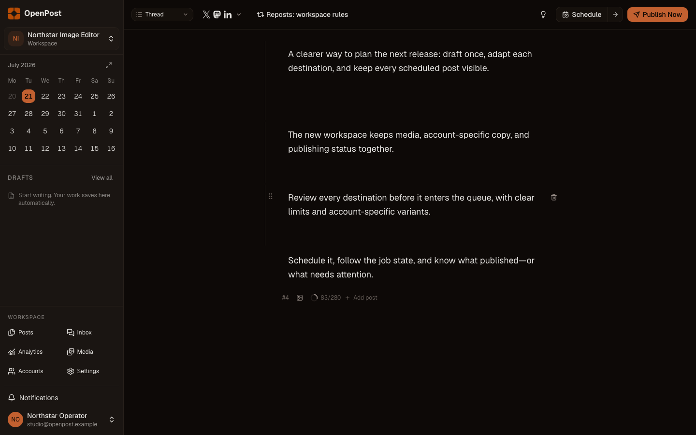
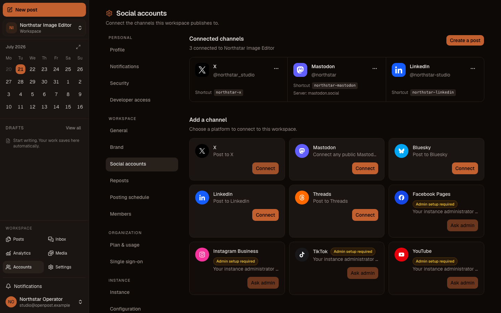
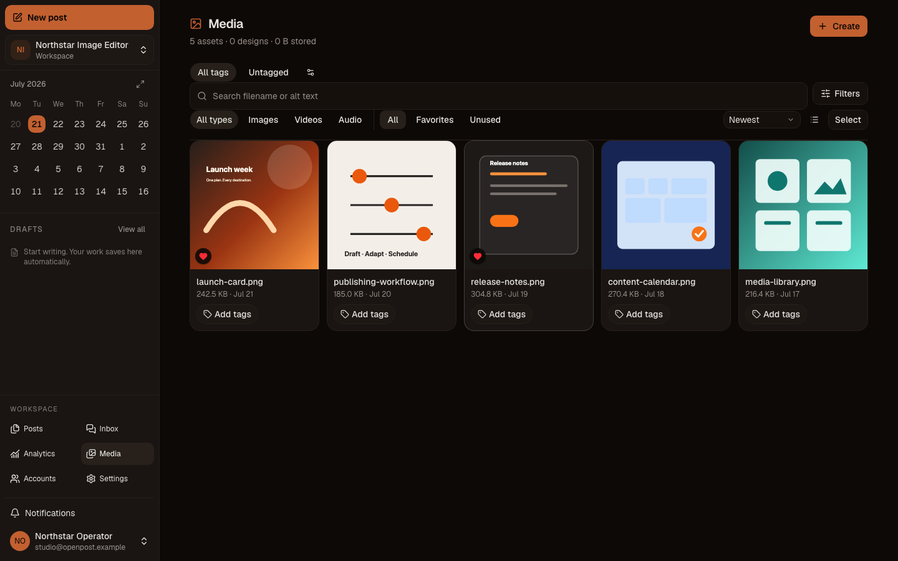

<p align="center">
  <a href="https://openpost.social">
    <picture>
      <source media="(prefers-color-scheme: dark)" srcset="./assets/brand/lockup-dark.svg">
      <source media="(prefers-color-scheme: light)" srcset="./assets/brand/lockup.svg">
      
    </picture>
  </a>
</p>

<p align="center">
  <strong>Turn what you are building into content. Publish it everywhere.</strong>
  <br>
  The all-in-one content team for solo founders.
</p>

<p align="center">
  <a href="https://github.com/rodrgds/openpost/releases">
    
  </a>
  <a href="https://github.com/rodrgds/openpost/actions/workflows/ci.yml">
    
  </a>
  <a href="https://github.com/rodrgds/openpost">
    
  </a>
  <a href="LICENSE">
    
  </a>
</p>

<p align="center">
  <a href="https://app.openpost.social/register?plan=founder&billing_period=monthly"><strong>Start a 14-day trial</strong></a>
  ·
  <a href="https://youtu.be/_mZf3HzQaN8"><strong>Watch the demo</strong></a>
  ·
  <a href="https://docs.openpost.social/guide/quickstart"><strong>Quickstart</strong></a>
  ·
  <a href="https://discord.gg/u2QwukmY4W"><strong>Discord community</strong></a>
</p>

<p align="center">
  
</p>

## One content team for companies of one

OpenPost helps solo founders turn launches, product updates, lessons, and ideas into content, then adapt, schedule, and track it from one workspace.

- **Write once, shape each destination.** Write a post or thread, select accounts or a Social Set, and OpenPost infers each destination format. Required fields and true format choices appear in the composer, and each account can still have its own content, schedule, and settings.
- **Reuse account groups.** Social Sets keep a stable group of accounts; each draft stores its own destination snapshot.
- **See the full schedule.** Plan posts in a calendar, reuse posting times, and check scheduled, published, and failed posts.
- **Track real platform numbers.** Keep account growth and post results while treating views, impressions, and reach as different metrics.
- **Repost posts that earn attention.** Set native repost rules for selected accounts, wait for minimum engagement or stable growth, and override the rules on any post.
- **Make still images.** Use OpenPost Image Editor without an account for local exports with no watermark, or save designs with workspace media and brand items.
- **Make memes from the composer.** When an operator enables Memegen, search community templates, edit every caption or image slot, optionally ask AI for several structured drafts, and save the selected result in Media with its recipe.
- **Draft image descriptions.** When an operator configures OpenRouter, OpenPost can fill shared alt text when users add an image that has none; users can review or replace it before publishing.
- **Make social videos locally.** OpenPost Video Editor can stream-copy combined or per-section cuts without transcoding, or open the complete desktop or touch editor for four social formats, local transcript editing, effects, recording, proxies, and watermark-free export.
- **Keep brands separate.** Workspaces isolate accounts, media, schedules, members, and automation access.
- **Manage replies and messages.** Read and reply to comments, get personal alerts, and turn on inbox collection for supported accounts.
- **Choose how users sign in.** Require email confirmation, enable Google login, link methods explicitly, or configure organization SSO.
- **Configure optional services in the app.** Instance admins can add encrypted billing, email, identity, stock media, feedback, and social provider credentials, and intentionally override allowlisted environment-backed settings with the fallback and override state kept visible.
- **Automate without sharing social account keys.** Use the API, CLI, or MCP with OpenPost tokens that you can limit to one workspace and remove.
- **Run a small server.** Use one container or binary, SQLite, local media, and saved background jobs. Redis is not required.

OpenPost does not include a CRM, ad manager, social listening, or large-company benchmarks.

<table>
  <tr>
    <td width="50%">
      
    </td>
    <td width="50%">
      
    </td>
  </tr>
  <tr>
    <td align="center"><strong>Connect social accounts to each workspace</strong></td>
    <td align="center"><strong>Reuse files and see where each one is used</strong></td>
  </tr>
</table>

## Provider implementations

OpenPost includes adapters for X, Mastodon, Bluesky, LinkedIn profiles and Organization Pages, Threads, Facebook Pages, Instagram Business and Creator accounts, TikTok, YouTube, and Discord webhooks.

An adapter is implementation evidence, not proof that a managed provider or format is ready. App review, effective setup, exact account access and scopes, API limits, policy mode, public media, runtime controls, and current local/live certification are separate gates.

<!-- provider-certification:begin -->

The checked-in public certification manifest contains **0 exact provider-format claims**.

No managed provider-format certification claim is current. Implementation descriptions do not assert managed availability.
<!-- provider-certification:end -->

See the [readiness and launch gate](https://docs.openpost.social/providers/launch-matrix) and [implementation table](https://docs.openpost.social/providers/platform-limits).

## Self-host in a few minutes

```bash
git clone https://github.com/rodrgds/openpost.git
cd openpost
cp .env.example .env
# Set OPENPOST_APP_URL and replace the two example secrets in .env.
docker compose up -d
```

Open `http://localhost:8080`, create the first account, and connect a social account. Bluesky is the fastest first test because it only needs a handle and app password.

The default Compose setup stores the SQLite database and uploaded media in one Docker volume. For a public server, put OpenPost behind HTTPS and set the public URL before you set up OAuth.

[Read the self-hosting quickstart →](https://docs.openpost.social/guide/quickstart)

Prefer not to operate it yourself? [Use the managed app](https://app.openpost.social).

## Scheduled posts survive restarts

OpenPost saves scheduled work in its database. A server restart does not remove it, and the app shows the result.

The self-hosted defaults stay small:

| Part              | Default                                       |
| ----------------- | --------------------------------------------- |
| Application       | One Go binary with the SvelteKit app embedded |
| Database          | SQLite                                        |
| Media             | Local storage                                 |
| Scheduled jobs    | Built into the database                       |
| Optional scale-up | PostgreSQL and S3-compatible storage          |

OpenPost encrypts social account keys with AES-256-GCM. You can limit API and MCP tokens to one workspace and remove them without reconnecting social accounts.

## Automation when you need it

The web app is the main place to review and control posts. The same access rules, checks, plan limits, and saved jobs also cover:

- the typed HTTP API;
- the `openpost` CLI for scripts, cron, and CI;
- the local and remote MCP interfaces for assistants and coding agents.

This lets an AI tool read workspace data, prepare account versions, and return them for review without seeing social account tokens.

[CLI guide](https://docs.openpost.social/cli/) · [MCP guide](https://docs.openpost.social/mcp/) · [API reference](https://docs.openpost.social/reference/api)

## Install another way

Releases include:

- Linux, macOS, and Windows server binaries;
- CLI and MCP binaries;
- the `linux/amd64` container image at `ghcr.io/rodrgds/openpost`;
- an Android APK.

The published container image is amd64-only; binary and CLI artifacts have their own architecture matrix. See the [installation docs](https://docs.openpost.social/self-hosting/) for supported artifacts, reverse proxies, storage, backups, upgrades, and the [`image-policy.json`](docker/image-policy.json) assurance contract.

## Contributing

OpenPost uses Go, Svelte 5, SvelteKit, and Bun. The repository includes a Devenv shell so local commands match CI.

```bash
direnv allow
devenv shell -- setup
devenv shell -- verify
```

Read [CONTRIBUTING.md](CONTRIBUTING.md) and the [development docs](https://docs.openpost.social/development/setup) before opening a pull request. Bug reports, focused feature proposals, documentation fixes, and tested provider improvements are welcome.

For setup questions, ideas, and general discussion, join the [OpenPost Discord community](https://discord.gg/u2QwukmY4W).

## Help OpenPost grow

If OpenPost is useful to you, **star the repository**. It helps other self-hosters find the project and tells us which work is worth continuing.

<!-- star-history:start -->
<picture>
  <source media="(prefers-color-scheme: dark)" srcset="assets/star-history/star-history-dark.svg">
  
</picture>
<!-- star-history:end -->

## License and security

OpenPost is licensed under [AGPL-3.0-only](LICENSE). Report vulnerabilities privately through the [security policy](SECURITY.md).
