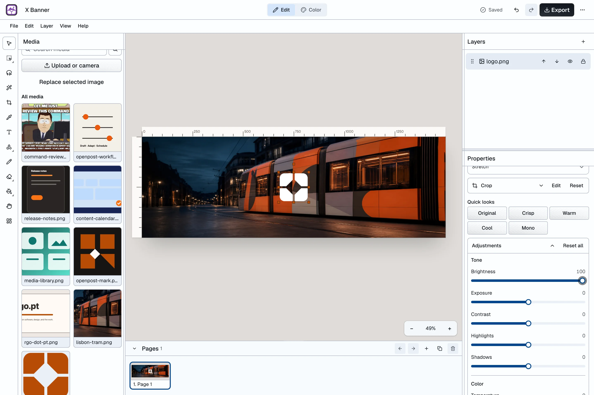
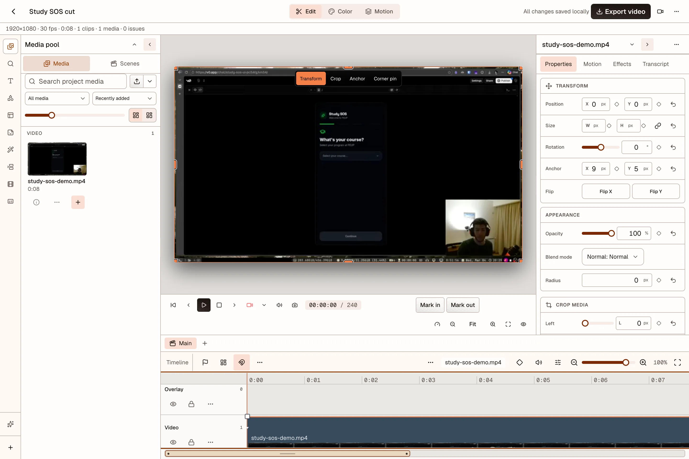

<p align="center">
  <a href="https://openpo.st">
    <picture>
      <source media="(prefers-color-scheme: dark)" srcset="./assets/brand/lockup-dark.svg">
      
    </picture>
  </a>
</p>

<h3 align="center">An open-source alternative to Buffer, Canva, and CapCut.</h3>

<p align="center">
  Write posts, design images and carousels, edit videos, and schedule your content in one app.<br>
  Self-host OpenPost or use OpenPost Hosted.
</p>

<p align="center">
  <a href="./LICENSE">
    <picture>
      <source media="(prefers-color-scheme: dark)" srcset="https://shieldcn.dev/github/license/getopenpost/openpost.svg?variant=outline&amp;size=sm&amp;font=geist&amp;mode=dark">
      
    </picture>
  </a>
  <a href="https://github.com/getopenpost/openpost/releases">
    <picture>
      <source media="(prefers-color-scheme: dark)" srcset="https://shieldcn.dev/github/release/getopenpost/openpost.svg?variant=outline&amp;size=sm&amp;font=geist&amp;mode=dark">
      
    </picture>
  </a>
  <a href="https://github.com/getopenpost/openpost/actions/workflows/ci.yml">
    <picture>
      <source media="(prefers-color-scheme: dark)" srcset="https://shieldcn.dev/github/ci/getopenpost/openpost.svg?variant=outline&amp;size=sm&amp;font=geist&amp;mode=dark">
      
    </picture>
  </a>
  <a href="https://github.com/getopenpost/openpost/stargazers">
    <picture>
      <source media="(prefers-color-scheme: dark)" srcset="https://shieldcn.dev/github/stars/getopenpost/openpost.svg?variant=outline&amp;size=sm&amp;font=geist&amp;mode=dark">
      
    </picture>
  </a>
</p>

<p align="center">
  <a href="https://app.openpo.st/image-editor"><strong>Try the image editor</strong></a>
  ·
  <a href="https://app.openpo.st/video-editor"><strong>Try the video editor</strong></a>
  ·
  <a href="#self-host"><strong>Self-host</strong></a>
  ·
  <a href="https://docs.openpo.st"><strong>Docs</strong></a>
</p>

<p align="center">
  Both editors are free to use without an account or watermark.<br>
  The video editor is in beta and supports current desktop Chrome and Edge.
</p>

<p align="center">
  <a href="https://www.youtube.com/watch?v=_mZf3HzQaN8">
    
  </a>
</p>

<p align="center">
  <a href="https://www.youtube.com/watch?v=_mZf3HzQaN8">Watch the product tour</a>
  ·
  <a href="https://openpo.st/#features">See all features</a>
</p>

<table>
  <tr>
    <td width="50%" align="center">
      <a href="https://app.openpo.st/image-editor">
        <picture>
          <source media="(prefers-color-scheme: dark)" srcset="./assets/screenshots/image-editor-dark.webp">
          
        </picture>
      </a>
      <br><strong>Design images and carousels</strong>
    </td>
    <td width="50%" align="center">
      <a href="https://app.openpo.st/video-editor">
        <picture>
          <source media="(prefers-color-scheme: dark)" srcset="./assets/screenshots/video-editor-dark.webp">
          
        </picture>
      </a>
      <br><strong>Edit and caption videos</strong>
    </td>
  </tr>
</table>

**Give OpenPost a star to support the project.**

## What you can do

-  **[Compose for each platform](https://docs.openpo.st/guides/publishing).** Write posts and threads, then adjust the text and media for each account. Preview each version before publishing. Save account groups as Social Sets to reuse them.

-  **[Image editor](https://docs.openpo.st/guides/image-editor).** Design images and multi-page carousels with layers, templates, and custom fonts. Remove backgrounds in your browser. Export individual pages or the full carousel, or attach them to your post.

-  **[Video editor](https://docs.openpo.st/guides/video-editor).** Trim and arrange clips on a multitrack timeline. Add captions, transitions, effects, and audio. Cut footage by selecting words in its transcript, or use the [recorder](https://docs.openpo.st/guides/recording) to capture your screen and camera.

-  **[Calendar and queues](https://docs.openpo.st/guides/scheduling).** Choose a publishing time or the next free slot in a queue. Plan your posts in the calendar, stagger publishing across accounts, and get reminders when your queue runs low.

- **Auto repost.** Set delays and engagement rules for native reposts on supported networks. Override the defaults for individual posts.

- **[Media library](https://docs.openpo.st/guides/media-library).** Keep reusable images, videos, fonts, and brand assets in your workspace. Organize files with tags, collections, and favorites. Attach saved media without uploading it again.

- **[Meme maker](https://docs.openpo.st/guides/media-library#add-media-to-a-post).** Pick a template, edit its captions, and replace its images. Save the result to your media library or attach it to a post.

- **[Inbox and messages](https://docs.openpo.st/guides/inbox).** Read and reply to supported comments and direct messages without switching between social apps.

-  **[Analytics and repurposing](https://docs.openpo.st/guides/analytics).** Compare post results and track audience changes across your accounts. Use a previous post as the starting point for a new draft.

- **Find people.** Find accounts to follow on Bluesky and Mastodon. Review the suggestions and choose who to follow.

- **AI writing and ideas.** Generate ideas, compare draft directions, and adapt posts for your selected platforms. You review the result before publishing. AI writing is optional. [Self-hosted AI setup](https://docs.openpo.st/self-hosting/ai).

- **[API, CLI, MCP, and n8n](https://docs.openpo.st/guides/automation).** Create drafts, schedule posts, and check publishing results from your scripts, agents, or n8n workflows. See the [API reference](https://docs.openpo.st/api-reference) for endpoints.

- **[Teams and workspaces](https://docs.openpo.st/guides/workspaces).** Keep brands and clients in separate workspaces and control who can edit them. Protect your account with passkeys, two-factor authentication, and session controls.

## Get started

### OpenPost Hosted

Use OpenPost to create and schedule posts without running your own server.

[Start a 14-day trial](https://app.openpo.st/register?plan=founder&billing_period=monthly) · [View plans](https://openpo.st/pricing)

### Self-host

The default setup runs in one Docker container with SQLite and local media storage. It does not need Redis or a separate database service. You can also use PostgreSQL and S3-compatible storage.

Install Docker Compose, curl, and OpenSSL, then run this in Bash. The script creates a new `openpost` directory with the Compose file and fresh secrets:

```bash
(
  set -eu
  mkdir openpost
  cd openpost

  curl -fsSL \
    https://raw.githubusercontent.com/getopenpost/openpost/main/docker-compose.yml \
    -o docker-compose.yml

  umask 077
  jwt_secret="$(openssl rand -base64 32)"
  encryption_key="$(openssl rand -base64 32)"

  cat > .env <<EOF
OPENPOST_APP_URL=http://localhost:8080
OPENPOST_PUBLIC_URL=http://localhost:8080
OPENPOST_MEDIA_URL=http://localhost:8080/media
OPENPOST_JWT_SECRET=$jwt_secret
OPENPOST_ENCRYPTION_KEY=$encryption_key
EOF

  docker compose up -d
)
```

Open http://localhost:8080 and create the first account. It becomes the instance administrator. Create a workspace, then configure the integrations for your social accounts.

The image targets `linux/amd64`. ARM machines need amd64 emulation. For a public instance, configure HTTPS and replace the three localhost URLs in `.env` with your public URLs before connecting social accounts.

For production, pin a release tag instead of `latest`. Back up the Docker data volume and `.env` together. Keep both secrets unchanged across restarts and restores.

[Self-hosting guide](https://docs.openpo.st/self-hosting/) · [Configure integrations](https://docs.openpo.st/self-hosting/integrations) · [Backups and upgrades](https://docs.openpo.st/self-hosting/maintenance)

## Supported platforms

<p>
  
  
  
  
  
  
  
  
  
  
</p>

OpenPost has integrations for Instagram, Facebook, LinkedIn, X, TikTok, YouTube, Threads, Bluesky, Mastodon, and Discord webhooks.

Posting formats, inbox features, and analytics vary by platform. Some integrations require provider app approval or publicly reachable media URLs.

[Connect accounts](https://docs.openpo.st/guides/accounts) · [Integration requirements](https://docs.openpo.st/self-hosting/integrations)

## Contributing

Report bugs, improve the docs, or send a pull request. For larger changes, open an issue first so we can agree on the approach.

OpenPost uses Go, SvelteKit, and Expo, with a Devenv development environment. Start with the [contributing guide](./.github/CONTRIBUTING.md) and [development setup](https://docs.openpo.st/development/setup).

[Report a bug](https://github.com/getopenpost/openpost/issues) · [Join Discord](https://discord.com/invite/u2QwukmY4W)

## Star history

<!-- star-history:start -->
<picture>
  <source media="(prefers-color-scheme: dark)" srcset="assets/star-history/star-history-dark.svg">
  
</picture>
<!-- star-history:end -->

## License and security

OpenPost uses the [AGPL-3.0-only license](./LICENSE). See the [third-party notices](./licenses/README.md) for dependency licenses and attribution.

Report vulnerabilities privately through the [security policy](./.github/SECURITY.md).
