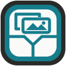
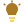
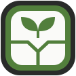
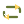

# Feature icons

These transparent SVG icons are public artwork for README feature tiles, public feature sections, and customer guides. Each icon uses a simple, recognizable pictogram on a 24px grid, with sparse square dither pixels near the edge. The artwork is identical in light and dark themes, so its midtone colors and pale accents are chosen to stay legible on both.

Use icons beside visible feature names. App controls, navigation, provider marks, status glyphs, and the protected OpenPost Converge mark keep their own icon systems. Do not use these feature icons in authenticated app chrome.

| Feature      | Icon                                                       | Palette              |
| ------------ | ---------------------------------------------------------- | -------------------- |
| Compose      |       | `#c96d32`, `#ffad66` |
| Image Editor |  | `#477d62`, `#72d18d` |
| Video Editor |  | `#526fa0`, `#ffd45c` |
| Calendar     |      | `#477d62`, `#72d18d` |
| Analytics    |     | `#477d62`, `#72d18d` |
| Media        |         | `#397b86`, `#72d18d` |
| Inbox        |         | `#a84b5b`, `#ffad66` |
| Accounts     |      | `#4770a0`, `#9fc3e4` |
| Recorder     |      | `#ad4e42`, `#ffad66` |
| Ideas        |         | `#a97925`, `#ffd45c` |
| Automation   |    | `#4770a0`, `#9fc3e4` |
| Grow         |          | `#477d62`, `#72d18d` |
| Repost       |        | `#667633`, `#ffd45c` |
| Workspaces   |    | `#875d3e`, `#ffad66` |
| Meme Maker   |         | `#a24d89`, `#ffd45c` |

The SVGs are hand-authored and remain sharp at small sizes. Distribute public artwork through `scripts/asset-surfaces.ts` and `bun scripts/sync-assets.mjs` when a consuming surface changes.
